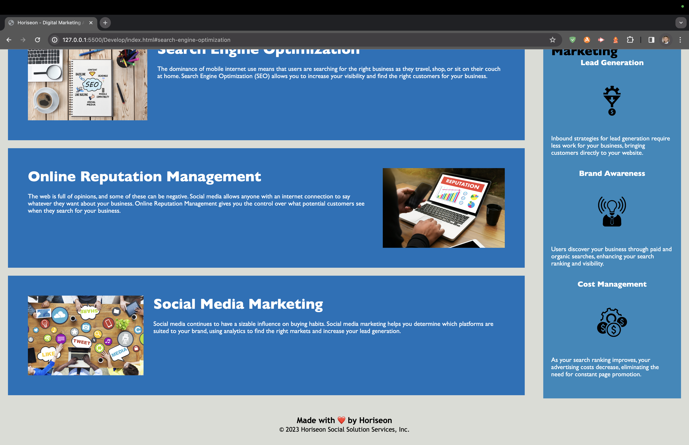

# Code Refactor Starter Code
# kenny-cummings-refactoring
## Module 1 symantic corrections
Let's make everything SEO optimal! The purpose of this is to find the weak code and make it stronger for SEO purposes. It's called refactoring! I'm motivated to do this so I can learn the process of coding and learn how to properly debug code. I want to become a front end web developer. I learned that you need to have determination and perseverance to overcome the obstacles of coding! The prework embraced having that mindset, knowing you will stumble.
 
 
The HTML required a lot of refactoring. The header was missing a title. The heading was misspelled within the body. I refactored so all links scroll, the Search Engine Optimization link was broken. I updated the HTML within the Benefits class. I replaced div with article. I added alt attributes to images. I altered heading text and added a h3. I provided structure for each benefit section with an article element. Lastly for the HTML, I refactored the footer by adding descriptive class names.
 
 
For the CSS, many of the redundant classes with the same formatting could be grouped together as one class. I had to updated the HTML accordingly.
 
 
Web Application URL: https://kennycummings.github.io/kenny-cummings-refactoring/
 
 

 
 
